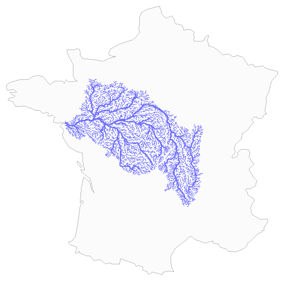

# The Art of PostgreSQL

[](https://codespaces.new/dimitri/TheArtOfPostgreSQL)

This repository contain The PostgreSQL practice lab used with the book [The
Art of PostgreSQL](https://theartofpostgresql.com).

Here, you can run real queries, explore realistic datasets, and observe how
PostgreSQL behaves in practice. Each example is designed to help you move
beyond theory: execute the queries, compare results, experiment with
variations, and understand performance trade-offs firsthand.

Use this lab alongside the book to turn concepts into working knowledge—and
to build an intuition for writing efficient, production-grade SQL.

The repository contains all of the SQL queries from the book, organized by
chapters, in a way that you can re-use them directly. The repository also
contains the Open Source data sets used through the book, and when needed
the scripts around the data sets that allow importing and processing them
into a Postgres database.

## Get the Full Course

This repository is the free public lab — the queries, the data, the
playground. The complete course goes deeper: 6 courses across 3 tiers
(Core, Advanced, Architect), with hands-on labs, quizzes, and
structured modules covering Window Functions, Aggregation, Schema
Design, Advanced JOINs, Query Optimization, and Read Query Plans.

**Now in early access — first 100 subscribers get 50% off.**
The Art of PostgreSQL book is included in every tier.

[Get early access at theartofpostgresql.com/course](https://theartofpostgresql.com/course/?utm_source=github&utm_medium=readme&utm_campaign=lab)

## Quick Start

```bash
docker compose up -d

open http://localhost:8042
```

That's the whole setup. `postgres` is pulled pre-seeded with every dataset
(including commitlog) from ghcr.io — no local build, no load-data step.
`query-ui` is a quick local build (a few seconds, just a Go binary). Both
happen automatically on first `up`.

Prefer building from source instead of pulling? `docker compose build`
compiles the loader, loads every dataset, and pg_dumps the result into the
image locally — a couple of minutes on a decent connection (most of that
time is network: base images, apt packages, ~2GB of git history for
commitlog, not compute) — and a subsequent `docker compose up -d` uses that
local build instead of the pulled image. To go back to the published image,
`docker compose pull postgres`.

`docker-compose.yml` only defines `postgres` and `query-ui`. Everything else
(loading individual datasets, an interactive `psql` session, refreshing the
commitlog data) lives in
[`docker/docker-compose.tools.yml`](docker/docker-compose.tools.yml), an
on-demand file you combine explicitly with `-f`:

```bash
docker compose -f docker-compose.yml -f docker/docker-compose.tools.yml run --rm -it psql
```

See [`docker/docker-compose.tools.yml`](docker/docker-compose.tools.yml) for
the other services it defines and when you'd reach for them.

## Query UI — Browse and Run Queries in the Browser

Alongside `psql`, this repo ships a small local web app for browsing and
running every query interactively — no client to install, nothing to
configure.

```bash
docker compose up -d postgres query-ui
```

Open **http://localhost:8042** — two views, switchable from the top nav:

- **Book Queries** (default) — the full table of contents from the book, one
  query per file, with a SQL editor, `EXPLAIN` (Text/Diagram/JSON tabs), CSV
  export, and a read-only/read-write toggle for the handful of queries that
  need `CREATE`/`INSERT`.

  

- **Starter Kit** (http://localhost:8042/starter-kit.html) — the same
  six-lab walkthrough described below, but as a runnable notebook: click
  **▶ Run** on any cell and see results inline, right next to the prose that
  explains them. PostGIS queries that build their own `<svg>...</svg>`
  output (the river-basin and pub-crawl maps) render as an actual map, not a
  wall of path data.

It's a single self-contained Go binary — no separate service to run, no
external JS/CSS dependencies, frontend embedded in the executable.

### Keeping it up to date

`queries/`, `starter-kit/`, and `toc.txt` are mounted read-only into the
container and indexed once at startup, so editing them on the host only
needs a restart:

```bash
docker compose restart query-ui
```

Changes to the app itself (anything under `src/query-ui/`, including the
frontend HTML) are compiled into the binary via `go:embed`, so they need a
rebuild before `up -d` will serve them:

```bash
docker compose build query-ui && docker compose up -d query-ui
```

Not sure which one you need? `docker compose build query-ui && docker
compose up -d query-ui` always works for both cases — it's just the slower
option when a plain restart would have been enough. To sanity-check what a
running container is actually serving:

```bash
curl -s http://localhost:8042/ | diff - src/query-ui/frontend/dist/index.html
```

An empty diff means the container is serving your latest code.

## Run this. See why PostgreSQL matters.

Start a psql session:

```bash
docker compose -f docker-compose.yml -f docker/docker-compose.tools.yml run --rm -it psql
```

Then run:

```sql
\i queries/04-sql-select/15-sql-102/03_01_f1db.decade.top3.sql
```

You’ll get:

* the **top 3 drivers per decade**
* computed from raw race results
* using a single SQL query

This query combines:

* window functions (`rank()`)
* aggregation (`count(*)`)
* a `LATERAL` join

If this query looks unfamiliar, that’s  the point — the starter kit explains
how it works.

### Postgres Practice Lab

This repository is a **hands-on PostgreSQL lab** where you can run queries
like this, explore real datasets, and understand how advanced SQL replaces
complex application logic.

## Starter Kit

If you’re new to this lab, begin with the **starter kit**.

→ Run it interactively at **http://localhost:8042/starter-kit.html** (see
[Query UI](#query-ui--browse-and-run-queries-in-the-browser) above), or read
it straight from the source in [`starter-kit/`](starter-kit/).

This is a **guided, hands-on learning path** built from a small set of
carefully selected queries. Instead of exploring hundreds of files, you will
focus on a few high-impact examples that demonstrate what PostgreSQL can
really do.

### What you’ll learn

The starter kit walks you through six advanced—but highly practical—SQL
patterns:

* **Nested LATERAL joins** — solve top-N per group problems cleanly
* **GROUPING SETS + FILTER** — compute multiple aggregations in a single query
* **percentile_cont()** — calculate multiple percentiles efficiently
* **k-Nearest-Neighbour search** — find the closest rows with `<->` and a GiST index
* **A map with no graphics library** — render a density map as text
* **WITH RECURSIVE** — walk a river network, or any tree, by following a parent reference

The last three are spatial, built on PostGIS. Each one draws a real map — like
the entire Loire river basin, gathered from a single `WITH RECURSIVE` query that
walks every reach upstream from the river's mouth:



### How to approach it

Each query is designed as a mini lab:

1. Read the problem
2. Follow the step-by-step build-up
3. Run the final query
4. Experiment with variations

Expect to spend **15–30 minutes** to complete the full starter kit.

Once you’ve completed the starter kit, you’ll have a solid foundation to
explore the rest of the repository and its full collection of queries.

If you want to go deeper into the concepts and patterns behind these
examples, see [The Art of PostgreSQL](https://theartofpostgresql.com) for
full explanations and additional material.

## Using the Queries

The `queries/` directory contains SQL examples organized by chapter. You can
view and execute them using psql.

See the file [QUERIES.md](QUERIES.md) for a list of queries per theme and
SQL feature.

Here we see an example that uses the query `03_01_f1db.decade.top3.sql` from
Chapter 14 Order By, Limit, No Offset of the book [The Art of
PostgreSQL](https://theartofpostgresql.com).

> The following query is a classic top-N implementation. It reports for each
> decade the top three drivers in terms of race wins. It is both a classic
> top-N because it is done thanks to a lateral subquery, and at the same
> time it’s not so classic because we are joining against computed data. The
> decade information is not part of our data model, and we need to extract
> it from the `races.date` column.

```bash
# Start psql
docker compose -f docker-compose.yml -f docker/docker-compose.tools.yml run --rm -it psql

# View a query file
\! cat queries/04-sql-select/15-sql-102/03_01_f1db.decade.top3.sql

# Execute a query
\i queries/04-sql-select/15-sql-102/03_01_f1db.decade.top3.sql
```

The query is the following:

``` sql
with decades as
(
   select extract('year' from date_trunc('decade', date)) as decade
     from races
 group by decade
)
select decade,
       rank() over(partition by decade
                   order by wins desc)
       as rank,
       forename, surname, wins

  from decades
       left join lateral
       (
          select code, forename, surname, count(*) as wins
            from drivers

                 join results
                   on results.driverid = drivers.driverid
                  and results.position = 1

                 join races using(raceid)

           where   extract('year' from date_trunc('decade', races.date))
                 = decades.decade

        group by decades.decade, drivers.driverid
        order by wins desc
           limit 3
       )
       as winners on true

order by decade asc, wins desc;
```

And the `docker compose run --rm -it psql` with `\i ...` shows the following
result of executing the query (without having to copy paste more than the
path to the file on-disk available in the container):

```
taop@taop=# \i 04-sql-select/15-sql-102/03_01_f1db.decade.top3.sql
 decade │ rank │ forename  │  surname   │ wins
════════╪══════╪═══════════╪════════════╪══════
   1950 │    1 │ Juan      │ Fangio     │   24
   1950 │    2 │ Alberto   │ Ascari     │   13
   1950 │    3 │ Stirling  │ Moss       │   12
   1960 │    1 │ Jim       │ Clark      │   25
   1960 │    2 │ Graham    │ Hill       │   14
   1960 │    3 │ Jackie    │ Stewart    │   11
   1970 │    1 │ Niki      │ Lauda      │   17
   1970 │    2 │ Jackie    │ Stewart    │   16
   1970 │    3 │ Emerson   │ Fittipaldi │   14
   1980 │    1 │ Alain     │ Prost      │   39
   1980 │    2 │ Ayrton    │ Senna      │   20
   1980 │    2 │ Nelson    │ Piquet     │   20
   1990 │    1 │ Michael   │ Schumacher │   35
   1990 │    2 │ Damon     │ Hill       │   22
   1990 │    3 │ Ayrton    │ Senna      │   21
   2000 │    1 │ Michael   │ Schumacher │   56
   2000 │    2 │ Fernando  │ Alonso     │   21
   2000 │    3 │ Kimi      │ Räikkönen  │   18
   2010 │    1 │ Lewis     │ Hamilton   │   46
   2010 │    2 │ Sebastian │ Vettel     │   41
   2010 │    3 │ Nico      │ Rosberg    │   23
(21 rows)
```

## Docker Setup

See [docker/README.md](docker/README.md) for detailed instructions.

## Datasets

See [datasets.md](datasets.md) for a complete list of available datasets and
how to load them.
